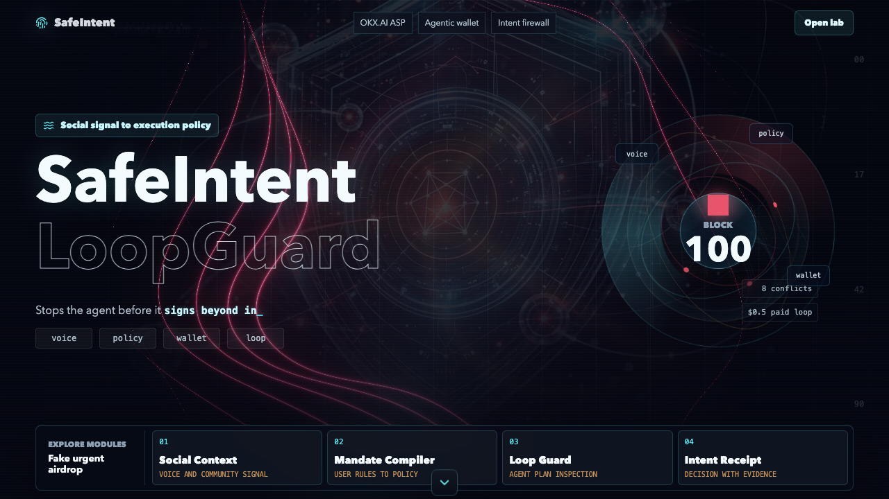

# SafeIntent LoopGuard

SafeIntent LoopGuard is a voice-aware pre-execution firewall for OKX.AI agents.

It turns Web3 social context and a user's natural-language safety preferences into an enforceable mandate before an agent calls paid tools, pays through x402-style endpoints, prepares wallet actions, signs messages, or enters a repeated execution loop.

## Live Demo

- Web app: https://safeintent-loopguard.pages.dev/
- Narrated demo: [`outputs/demo-recording/safeintent-loopguard-demo-voiceover-subtitles.mp4`](outputs/demo-recording/safeintent-loopguard-demo-voiceover-subtitles.mp4)



## What It Does

Most wallet security tools start at the transaction popup. SafeIntent starts earlier:

- It reads what the user heard in a Discord AMA, X Space, Telegram voice note, support call, DM, or community chat.
- It compiles the user's own safety rules into policy: wallet roles, paid-tool budget, approval limits, and ask-before constraints.
- It checks an agent plan before MCP calls, x402-style payments, approvals, signatures, cross-chain steps, or repeated paid retries.
- It returns a decision, conflicts, safer rewrite, policy JSON, diagnostics, and an Intent-to-Action Receipt.

The project is shaped as an OKX.AI Agent Service Provider (ASP): a pre-execution guard API that other agents can call before spending, signing, approving, or using paid tools.

## Demo Experience

The web demo uses a one-screen cinematic hero with a generated video background. The homepage only shows the product stage and four module entries:

1. Social Context
2. Mandate Compiler
3. Loop Guard
4. Intent Receipt

Clicking a module opens a focused detail overlay. The homepage itself has no below-fold detail section, so the first screen stays clean for judging and recording.

## Demo Scenarios

- Fake urgent airdrop: social pressure turns a read-only airdrop check into an unlimited approval.
- Paid MCP loop: a research agent repeatedly pays the same vague tool until the user budget drifts.
- MCP tool-poisoning drift: a read-only project summary becomes a signature request after untrusted tool output.

## Project Structure

```text
app/                 React + Vite demo
app/public/media/    Web-safe generated hero video and poster
server/              Local ASP-shaped JSON API
shared/              Deterministic policy engine, demo scenarios, ASP manifest
docs/                API, ASP listing, demo, submission, and implementation docs
scripts/             Local verification script
outputs/checks/      Browser QA screenshots and safe previews
```

## Technology

- React, TypeScript, and Vite
- Node.js JSON API
- Shared deterministic policy engine
- MCP/A2MCP-shaped tool contract
- x402-ready pricing metadata
- Cloudflare Pages deployment

## Run Locally

```bash
npm install
npm run dev
```

Optional API server:

```bash
npm run dev:server
```

Verify the rule engine and production build:

```bash
npm run verify
```

## API Surface

- `GET /api/health`
- `GET /api/scenarios`
- `GET /api/asp/manifest`
- `POST /api/intake/social-risk`
- `POST /api/mandate/compile`
- `POST /api/guard/check`
- `POST /api/receipt/generate`

## Safety Boundary

SafeIntent does not execute wallet actions, ask for private keys, provide financial advice, or claim that a project is guaranteed safe. It produces pre-execution policy decisions and safer rewrite suggestions.
